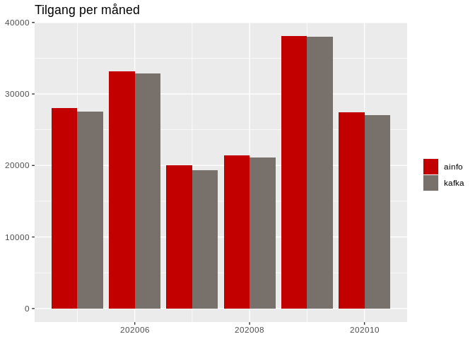

Analyse av stillinger
================

Vi har sett litt på forskjellen av beregning av tilganger og beholdning
av stillinger med ny og gammel løsning. Den gamle løsningen leser fra
Arena (hvor kafka topicet blir pre-prossesert) og kjørt gjennom Ainfo.
Litt dokumentasjon finnes
[her](https://confluence.adeo.no/pages/viewpage.action?pageId=366840526).
Den nye løsningen aggregerer stillingene i python, dokumentasjon finnes
her.

Vi inkluderer alle stillinger fra mai til oktober 2020 i denne
sammenligningen.

## Tilgang per måned

Vi prøver å telle antall nye stillinger som blir annonsert hver måned.

<!-- -->

Som tabell:

| aarmnd | ainfo | kafka |
| -----: | ----: | ----: |
| 202005 | 28051 | 27497 |
| 202006 | 33174 | 32890 |
| 202007 | 20032 | 19336 |
| 202008 | 21457 | 21069 |
| 202009 | 38113 | 38030 |
| 202010 | 27440 | 27041 |

## Tilgang per bransje

Vi prøver å telle antall nye stillinger som blir annonsert per bransje
(funnet fra dimensjoner2.dim\_styrk).

<!-- -->

Som tabell:

| bransje\_grov                      | ainfo | kafka |
| :--------------------------------- | ----: | ----: |
| Akademiske yrker                   |  7954 |  7771 |
| Barne- og ungdomsarbeid            |  5862 |  5769 |
| Butikk- og salgsarbeid             | 17045 | 17178 |
| Bygg og anlegg                     | 19280 | 19068 |
| Helse, pleie og omsorg             | 36766 | 35622 |
| Industriarbeid                     | 10197 | 10063 |
| Ingen yrkesbakgrunn eller uoppgitt |  1545 |  1555 |
| Ingeni?r- og ikt-fag               | 14003 | 13984 |
| Jordbruk, skogbruk og fiske        |  1417 |  1376 |
| Kontorarbeid                       |  9075 |  8928 |
| Ledere                             |  3757 |  3796 |
| Meglere og konsulenter             |  6251 |  6141 |
| Reiseliv og transport              | 10644 | 10482 |
| Serviceyrker og annet arbeid       | 12487 | 12373 |
| Undervisning                       | 11984 | 11757 |

<!-- -->

## Tilgang per fylke

<!-- -->

Som tabell:

| fylkesnavn              | ainfo | kafka |
| :---------------------- | ----: | ----: |
| 01 østfold              |    NA |     5 |
| 03 Oslo                 | 34720 | 34575 |
| 11 Rogaland             | 14294 | 14218 |
| 12 Hordaland            |    NA |     4 |
| 15 Møre og Romsdal      |  7670 |  7606 |
| 18 Nordland             |  7361 |  7275 |
| 30 Viken                | 31168 | 31081 |
| 34 Innlandet            |  8803 |  8694 |
| 38 Telemark og Vestfold | 11433 | 11352 |
| 42 Agder                |  7599 |  7436 |
| 46 Vestland             | 20227 | 19565 |
| 50 Trøndelag            | 15350 | 14570 |
| 54 Finnmark og Troms    |  9422 |  9372 |
| 99 øvrige omrøder       |    84 |    84 |
| UKJENT                  |    NA |    26 |
| UTLAND                  |   136 |    NA |
